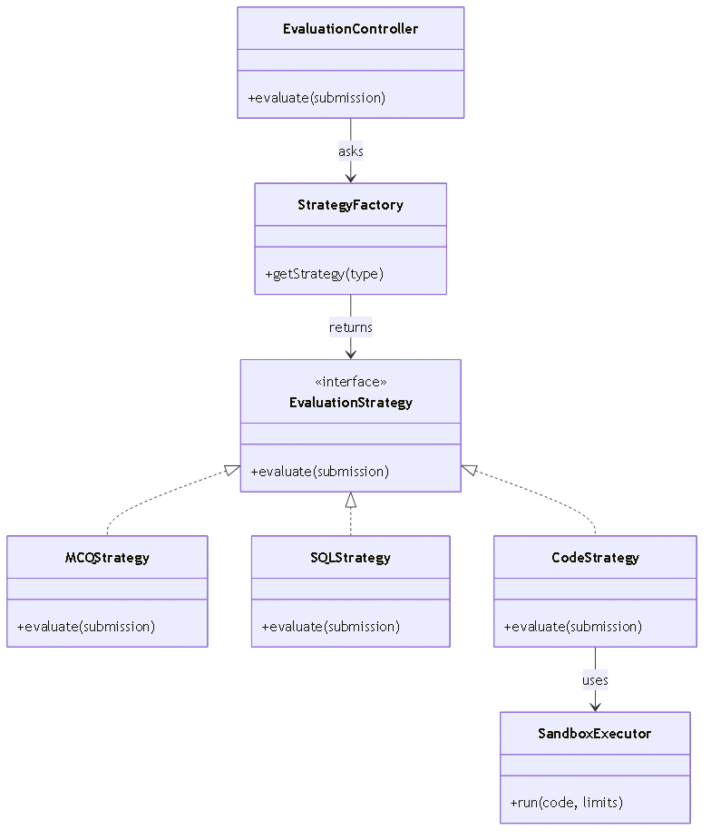
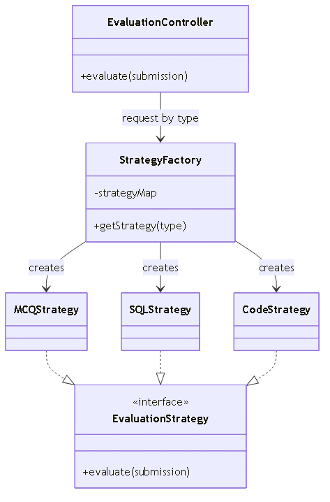
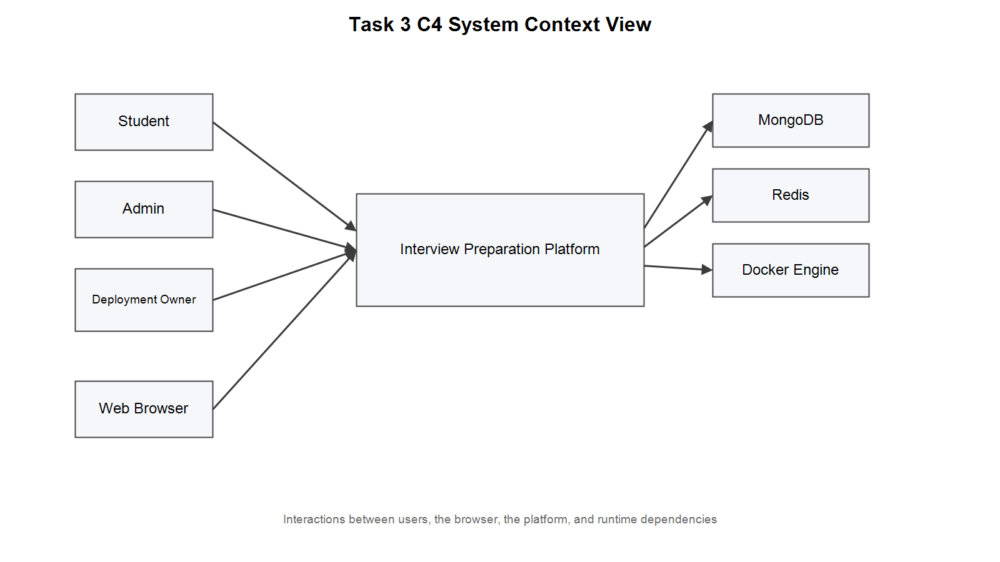
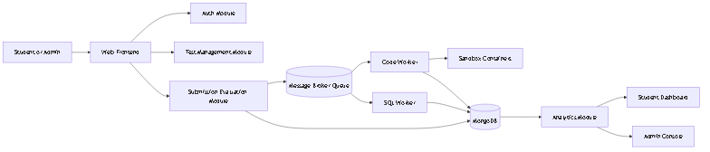
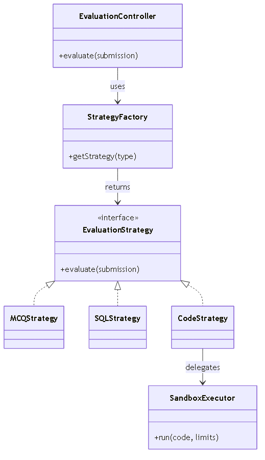

Team 27

Project: Interview Preparation Platform

GitHub Repository: [https://github.com/omii2403/se-project-3.git](https://github.com/omii2403/se-project-3.git)

# Task 1: Requirements and Subsystems

## 1.1 Functional Requirements

| ID | Requirement | Architectural Significance |
|---|---|---|
| FR-1 | Students and admins can register, log in, verify tokens, and manage their profile | Drives authentication, token verification, and role propagation across protected functionality |
| FR-2 | Protected functionality requires a valid JWT, and admin-only functionality rejects student access | Drives global access control and role-based authorization |
| FR-3 | Admins can create, edit, deactivate, and permanently delete questions | Drives question bank CRUD, role protection, and write-path invalidation |
| FR-4 | The question bank supports code, MCQ, and SQL questions | Drives flexible storage and evaluation logic for mixed question types |
| FR-5 | Students can start timed tests filtered by topic, type, difficulty, count, and duration | Drives test session generation and server-side timing logic |
| FR-6 | Test creation prefers unseen questions for a student, while allowing controlled repetition when needed | Drives question-selection policy and test continuity when the pool is limited |
| FR-7 | Students can run sample test cases for code questions during an active timed session | Drives secure sample-run support in the test flow |
| FR-8 | Timed tests record anti-cheat violations and auto-submit on the second violation | Drives test integrity enforcement and violation tracking |
| FR-9 | Final timed-test submission stores answers, evaluates them, and returns a summary | Drives evaluation, persistence, and result reporting |
| FR-10 | Submission APIs support idempotency keys and queue status tracking | Drives duplicate-prevention behavior and async job visibility |
| FR-11 | Admins can manage users and students with safety checks | Drives admin-only user management and delete safeguards |
| FR-12 | Students can view performance history and weak areas | Drives analytics aggregation and read-side caching |

### Architecturally Significant Requirements

The most significant requirements are safe code execution, async evaluation, and exam integrity. Safe code execution requires isolated sandboxing so untrusted code does not affect the host process. Async evaluation is needed because code execution is slow compared with normal API responses, so the system must decouple submission creation from evaluation. Exam integrity requires server-side enforcement of timing and anti-cheat rules so the timed test flow cannot be bypassed on the client.

## 1.2 Non-Functional Requirements

| ID | Requirement | Architectural Significance |
|---|---|---|
| NFR-1 | Performance: results within 5 seconds | Drives async queue decoupling, cache-aside reads, startup warm-up, and Docker timeout limits |
| NFR-2 | Scalability: services scale independently | Drives worker concurrency, queue-based decoupling, and stateless JWT design |
| NFR-3 | Security: Docker sandbox and JWT auth | Drives sandbox resource limits, network isolation, and global API auth middleware |
| NFR-4 | Availability: 99.5% uptime target | Drives health and readiness endpoints, worker heartbeat, retries, and dead-letter handling |
| NFR-5 | Usability: responsive flow with no training needed | Drives role-separated frontend routes and clear student/admin flows |
| NFR-6 | Maintainability: modular codebase | Drives the modular monolith structure with strict internal boundaries |
| NFR-7 | Observability: structured logs and telemetry | Drives request logging, runtime metrics, and worker monitoring |
| NFR-8 | Freshness: reads reflect recent writes quickly | Drives cache invalidation on write paths |

### Quantified System-Level Constraints

| NFR | Metric | Target / Constraint | Acceptance Check |
|---|---|---|---|
| NFR-1 Performance | Submission acknowledgement latency | p95 <= 500 ms under normal load | Monitor the API latency snapshot |
| NFR-1 Performance | Evaluation time budget per question | hard timeout <= 10 s | Verify timeout behavior in evaluator results |
| NFR-2 Scalability | Parallel evaluation capacity | worker concurrency = 2 by default | Inspect worker configuration |
| NFR-3 Security | Sandbox isolation | 100% code runs with 1 CPU, 256 MB memory, and no network access | Audit Docker runner settings |
| NFR-3 Security | API protection coverage | 100% of protected API requires JWT except signup/signin | Route and middleware audit |
| NFR-4 Availability | Readiness dependency gate | readiness returns 503 when MongoDB, Redis, or worker is unhealthy | Stop a dependency and verify response |
| NFR-7 Observability | Runtime telemetry window | 5-minute latency and worker telemetry snapshots available | Check monitor dashboard response |
| NFR-8 Freshness | Cache staleness control | submissions cache TTL 8000 ms, topics cache TTL 60000 ms | Verify cache TTLs and invalidation behavior |

## 1.3 Subsystem Overview

The platform is implemented as a modular monolith backend with a React frontend and an async worker for heavy evaluation.

### Presentation Subsystem
The frontend provides role-aware flows for students and admins. Student pages cover login, test building, timed tests, submissions, analytics, and profile. Admin pages cover question management, user management, and platform monitoring.

### Identity and Access Subsystem
The auth module handles registration, login, token verification, and profile-related access. The users module provides admin-only management of student accounts with safety checks.

### Test and Question Subsystem
The questions module manages code, MCQ, and SQL questions. The tests module handles timed session creation, question delivery, sample runs, anti-cheat violations, and final submission.

### Evaluation and Queue Subsystem
The submissions module accepts submission requests and enqueues them for processing. The evaluation module consumes queued jobs, applies the correct strategy, and writes back results. Code evaluation runs inside Docker.

### Analytics and Monitoring Subsystem
The analytics module provides student summaries and admin overviews. The monitor module exposes operational telemetry, queue state, and worker health information.

### Data and Cache Subsystem
MongoDB stores the persistent domain data. In-memory caches improve read performance for summaries, submissions lists, and question topics, with invalidation on writes.

### Runtime Dependencies
The system depends on MongoDB for persistent storage, Redis for queueing and telemetry, and Docker for isolated code execution.

# Task 2: Architecture Framework

## 2.1 Stakeholder Identification Based on IEEE 42010

### Stakeholders and Concerns

| Stakeholder | Role | Key Concerns |
|---|---|---|
| Students | Main users taking timed tests and practice sessions | Simple test flow, fair anti-cheat handling, fast feedback, and clear results |
| Administrators | Manage questions, users, and platform data | Reliable CRUD, role protection, monitoring visibility, and data correctness |
| Developers | Build and maintain the codebase | Modular boundaries, testability, clear APIs, and low setup friction |
| Deployment Owner | Runs the service environment | Secure code execution, controlled infrastructure cost, health visibility, and recoverability |

### Architecture Viewpoints and Views

#### Logical Viewpoint
This viewpoint addresses maintainability and role isolation. The backend is organized into modules such as auth, users, questions, tests, submissions, analytics, monitor, evaluation, and shared. The frontend is separated into student and admin flows with route-level protection.

#### Process Viewpoint
This viewpoint addresses performance and responsiveness. Timed tests are session-based and validated server-side. Submission evaluation is asynchronous: the API enqueues work, and the worker evaluates jobs in the background.

#### Deployment Viewpoint
This viewpoint addresses setup simplicity and runtime isolation. The backend API and worker are separate Node.js processes. MongoDB stores persistent data, Redis provides queue and telemetry support, and Docker provides isolated execution for code submissions.

#### Security Viewpoint
This viewpoint addresses unauthorized access and safe execution of untrusted code. A global API auth gate protects all protected functionality, while admin-only functionality uses a role guard. Docker execution is constrained with CPU, memory, timeout, and network limits.

#### Operational Viewpoint
This viewpoint addresses incident detection and debugging. Structured logs, monitor endpoints, worker telemetry, readiness checks, and startup cache warm-up support operations and response-time stability.

## 2.2 Major Design Decisions

### ADR-001: Docker Containers for Code Execution
Status: Accepted

Context: Student code is untrusted and must not run in the API process. Running it directly would create risk of infinite loops, memory exhaustion, and crashes that affect all users.

Decision: Code execution happens inside short-lived Docker containers with resource and network limits. The constraints are 256 MB RAM, 1 CPU core, no network access, and a 10-second execution timeout.

Consequences:
- Each submission is fully isolated. A crashing submission cannot affect other users or the API process.
- Adding a new language requires only adding a language profile entry in dockerRunner.js.
- Container startup adds overhead to each code evaluation path.
- Docker must be installed on the host.

### ADR-002: Asynchronous Message Queue for Submission Processing
Status: Accepted

Context: Code evaluation takes longer than a normal API request. Processing evaluations synchronously on the API request thread would block threads and cause timeouts under concurrent load.

Decision: The submission API stores the job as QUEUED, enqueues it to BullMQ, and returns 202 immediately. A separate worker process consumes jobs, evaluates in Docker, and writes results back. The frontend polls for the result using the submission ID.

Consequences:
- API response time for submission creation is decoupled from evaluation duration.
- Burst submissions are buffered in the queue rather than causing server timeouts.
- Additional operational complexity: Redis must be running, and the worker process must be separately managed.
- Job retries and a dead-letter queue handle failures.

### ADR-003: Adopt Modular Monolith Architecture
Status: Accepted

Context: The team size and timeline make microservices unnecessary and too expensive operationally. Service discovery, distributed transactions, and complex deployment overhead would not be justified at this scale.

Decision: Use one deployable application with strict internal module boundaries. Each module has its own folder, routes, and data access layer. Modules communicate through function calls, not network calls. The module structure is auth, users, questions, tests, submissions, analytics, monitor, evaluation, and shared.

Consequences:
- Simple deployment: one process, one setup step.
- Team members can work on separate modules without merge conflicts.
- Module boundaries are enforced by convention, not by the language or runtime.
- If the project scales, modules can be extracted into separate services with minimal refactoring because the boundaries are already clean.

### ADR-004: Use JWT Stateless Authentication
Status: Accepted

Context: The platform has two user roles with different permissions. A stateless token-based approach avoids server-side session storage.

Decision: On login, the server issues a signed JWT containing userId, role, and expiry (24 hours). The client sends the token in the Authorization header on every request. Server middleware verifies the signature and extracts claims without a database query. Admin routes additionally check the role claim.

Consequences:
- Authentication is fast: no database lookup, just a signature check.
- Stateless design supports horizontal scaling.
- Token revocation before expiry is not supported in the current prototype. A blacklist would be required in production.

### ADR-005: Use MongoDB for Primary Data Storage
Status: Accepted

Context: The platform stores heterogeneous data: coding, MCQ, and SQL questions each have different fields, submission outputs contain nested execution results, and schema changes are frequent during the prototype phase.

Decision: MongoDB is used as the primary document database. Mongoose provides schema validation at the application layer. Related entities use reference IDs. Service code enforces integrity rules that a relational database would enforce with foreign keys.

Consequences:
- Different question types coexist in one collection with flexible per-type fields.
- Schema evolution is fast, with no heavy migration steps during prototyping.
- Integrity, such as referential consistency between submissions and questions, must be maintained in application code.
- Complex analytics queries use MongoDB aggregation pipelines.

# Task 3: Architectural Tactics and Patterns

## 3.1 Architectural Tactics

### Tactic 1: Asynchronous Submission Processing

What is implemented:
- Submission API stores request as QUEUED and pushes job to BullMQ queue.
- Worker consumes jobs and updates lifecycle (QUEUED -> RUNNING -> COMPLETED/FAILED).
- Queue status endpoint provides waiting/active/completed/failed counts.

Code evidence:
```text
Task4/backend/src/submissions/submissions.routes.js
Task4/backend/src/evaluation/queue.js
Task4/backend/src/worker.js
Task4/backend/src/evaluation/processSubmission.js
```

NFR mapping:
- NFR1 Performance: request path is short because evaluation runs in worker.
- NFR3 Reliability: retries and dead-letter queue are configured for failure handling.
- NFR4 Availability: heavy evaluation does not block normal API requests.

Trade-off:
- Better responsiveness, but added operational complexity (Redis + worker + queue monitoring).

### Tactic 2: Sandboxed Code Execution with Resource Limits

What is implemented:
- Code submissions are executed inside Docker containers.
- Runtime limits are enforced with --cpus 1, --memory 256m, --network none, and timeout handling.

Code evidence:
```text
Task4/backend/src/evaluation/dockerRunner.js
```

NFR mapping:
- NFR2 Security: untrusted code is isolated from API process and host network.
- NFR3 Reliability: timeouts and limits reduce risk of runaway execution.

Trade-off:
- Strong safety, but extra startup and execution overhead compared to in-process execution.

### Tactic 3: Cache-Aside Read Path with Invalidation and Warm-Up

What is implemented:
- Hot read APIs use in-memory cache for submissions list, question topics, and summaries.
- Cache invalidation runs on relevant write operations.
- Startup warm-up preloads selected caches.

Code evidence:
```text
Task4/backend/src/shared/summaryCache.js
Task4/backend/src/submissions/submissionReadService.js
Task4/backend/src/questions/questions.routes.js
Task4/backend/src/shared/cacheWarmup.js
Task4/backend/src/server.js
```

NFR mapping:
- NFR1 Performance: repeated reads are served faster.
- NFR8 Freshness: explicit invalidation keeps cache aligned after writes.

Trade-off:
- Better read speed, but requires careful invalidation to avoid stale responses.

### Tactic 4: Centralized API Authentication + Role-Based Authorization

What is implemented:
- Global middleware on /api enforces authentication except signup/signin.
- Admin-only routes use role guard middleware.
- User management routes include safety constraints such as self-delete prevention and seed-admin protection.

Code evidence:
```text
Task4/backend/src/app.js
Task4/backend/src/shared/middleware/requireAuth.js
Task4/backend/src/shared/middleware/requireRole.js
Task4/backend/src/users/users.routes.js
```

NFR mapping:
- NFR2 Security: protected APIs are not accessible without valid token/role.
- NFR6 Maintainability: centralized gate reduces repeated route-level security code.

Trade-off:
- Clear and consistent access control, but route exceptions must be maintained carefully.

### Tactic 5: Runtime Observability (Health + Metrics + Structured Logs)

What is implemented:
- Health endpoints expose liveness and readiness for MongoDB, Redis, and worker heartbeat.
- Runtime metrics include API latency samples and worker queue/evaluation telemetry.
- Admin monitor dashboard endpoint aggregates API, queue, and worker data.

Code evidence:
```text
Task4/backend/src/app.js
Task4/backend/src/shared/runtimeMetrics.js
Task4/backend/src/shared/workerTelemetry.js
Task4/backend/src/monitor/monitor.routes.js
```

NFR mapping:
- NFR4 Availability: readiness checks support faster failure detection.
- NFR7 Observability: metrics and logs make production debugging easier.

Trade-off:
- Better operability, but extra telemetry code and storage overhead.

## 3.2 Implementation Patterns

### Pattern 1: Strategy Pattern (Evaluation Logic)

Role in system:
- Evaluation logic is split by question type: CodeStrategy, McqStrategy, and SqlStrategy.
- Each strategy implements its own evaluate behavior.

Code evidence:
```text
Task4/backend/src/evaluation/strategies/CodeStrategy.js
Task4/backend/src/evaluation/strategies/McqStrategy.js
Task4/backend/src/evaluation/strategies/SqlStrategy.js
Task4/backend/src/evaluation/processSubmission.js
```

Why this pattern fits:
- Prevents one large conditional block for all question types.
- Makes each evaluator easier to test and evolve independently.

Diagram:


Diagram source: [Task3/diagrams/task3-uml-strategy.mmd](Task3/diagrams/task3-uml-strategy.mmd)

### Pattern 2: Factory Method Pattern (Strategy Creation)

Role in system:
- createEvaluationStrategy(type) creates a concrete strategy instance based on question type.
- The processing pipeline depends on the abstraction (strategy.evaluate) instead of direct class construction in multiple places.

Code evidence:
```text
Task4/backend/src/evaluation/strategyFactory.js
Task4/backend/src/evaluation/processSubmission.js
```

Why this pattern fits:
- Centralizes creation logic for evaluators.
- Adding a new evaluator type mainly affects one mapping point.

Diagram:


Diagram source: [Task3/diagrams/task3-uml-factory.mmd](Task3/diagrams/task3-uml-factory.mmd)

## 3.3 Architecture Pattern Context

### Modular Monolith
- Single backend deployable with clear internal modules (auth, users, questions, tests, submissions, evaluation, analytics, monitor).
- Fits team size and prototype delivery timeline.

### Event-Driven Worker Flow
- Submission processing is event/job driven through BullMQ queue and worker consumers.
- Decouples request-response API from evaluation execution path.

## 3.4 NFR to Tactic Traceability Matrix

| NFR | Main Tactics | Evidence |
|---|---|---|
| NFR1 Performance | Async queue, cache-aside reads | submissions routes, queue/worker, submissionReadService |
| NFR2 Security | Auth gate, role checks, Docker sandbox | app.js auth middleware, requireRole, dockerRunner |
| NFR3 Reliability | Queue retries, dead-letter queue, execution timeout | queue.js, worker.js, dockerRunner.js |
| NFR4 Availability | Readiness endpoints, worker heartbeat metrics | app.js health endpoints, workerTelemetry |
| NFR6 Maintainability | Modular monolith boundaries, strategy + factory separation | module structure, strategyFactory, strategies |
| NFR7 Observability | Structured request logs, monitor dashboard, telemetry snapshots | app.js logger, monitor.routes, runtimeMetrics |
| NFR8 Freshness | Cache invalidation on write paths | summaryCache + submissions/questions write handlers |

## 3.5 Diagram References

### C4 System Context View


Diagram source: [Task3/diagrams/task3-c4-system-context.mmd](Task3/diagrams/task3-c4-system-context.mmd)

### C4-style Container View


Diagram source: [Task3/diagrams/task3-c4-container.mmd](Task3/diagrams/task3-c4-container.mmd)

### Strategy and Factory Overview


Diagram source: [Task3/diagrams/task3-uml-strategy-factory-overview.mmd](Task3/diagrams/task3-uml-strategy-factory-overview.mmd)

# Task 4: Prototype Implementation and Analysis

## 4.1 Prototype Scope

The prototype implements two complete end-to-end non-trivial functionalities:

Functionality 1: Timed Test with Anti-Cheat
- Student selects topics, question types, and difficulty to build a custom test.
- System assembles a timed session, delivering shuffled questions with server-side time enforcement.
- Student can run sample test cases against code before final submission.
- Tab-switch violations are recorded. Two violations trigger an automatic final submit.
- On final submit, all answers are submitted to the async evaluation pipeline.

Functionality 2: Async Submission Pipeline with Docker Sandbox
- Student submits code (JavaScript, Python, or C++), an MCQ answer, or a SQL query.
- API persists the submission as QUEUED and enqueues it to BullMQ (202 response in under 50 ms).
- Worker picks up the job and runs the appropriate evaluation strategy.
- Code evaluation runs in an isolated Docker container with enforced resource and time limits.
- Result is written back to the submission document. Frontend polls for completion.

Additional implemented features:
- JWT authentication and role-based frontend routing
- Admin question management (create, edit, deactivate, permanent delete)
- Admin user management with safety guards
- Student submissions page with filter and pagination
- Student analytics dashboard showing topic breakdown and weak areas
- Admin overview dashboard with platform-wide metrics
- Monitor endpoint with queue and worker telemetry
- Health and readiness endpoints
- Backend integration tests for timed test flow and user management guards
- Idempotency key support on submissions to prevent duplicate processing

## 4.2 Implemented Architecture

Pattern: Modular monolith backend with event-driven async evaluation path.

Stack:
- Backend: Node.js 20, Express 4, Mongoose 8
- Frontend: React 18, Vite 8
- Queue: BullMQ 5 on Redis 7
- Database: MongoDB 7 with Mongoose schema validation
- Code execution: Docker (node:20-alpine, python:3.12-alpine, gcc:14)
- Auth: JSON Web Tokens (jsonwebtoken library), bcryptjs password hashing
- SQL evaluation: alasql in-process engine

Backend module structure:
```
backend/src/
  auth/          - signup, signin, verify
  users/         - admin user management
  questions/     - question bank CRUD
  tests/         - session lifecycle, anti-cheat
  submissions/   - async submission API
  evaluation/    - strategies, factory, docker runner, queue, worker
  analytics/     - student summary, admin overview
  monitor/       - health, telemetry dashboard
  models/        - Mongoose schemas (User, Question, Submission, TestSession, ViolationAudit)
  shared/        - config, JWT middleware, cache, logger, DB, Redis
  app.js         - express setup, global middleware, health routes
  server.js      - DB connect, cache warmup, listen
  worker.js      - BullMQ worker, heartbeat, dead-letter
```

## 4.3 Key Configuration Values (from config.js)

These values define the observable performance and security boundaries of the prototype.

- **DOCKER_TIMEOUT_SEC (10 s):** Maximum code execution time per submission.
- **WORKER_CONCURRENCY (2):** Parallel jobs the worker processes simultaneously.
- **SUBMISSIONS_LIST_CACHE_TTL_MS (8000 ms):** TTL for paginated submissions list cache.
- **QUESTION_TOPICS_CACHE_TTL_MS (60000 ms):** TTL for question topics list cache.
- **SUMMARY_CACHE_TTL_MS (15000 ms):** TTL for student/admin summary caches.
- **SUMMARY_CACHE_MAX_ENTRIES (2000):** Maximum cache entries before LRU eviction.
- **WORKER_HEARTBEAT_INTERVAL_MS (5000 ms):** How frequently the worker writes a heartbeat to Redis.
- **WORKER_READY_STALE_MS (30000 ms):** Worker is considered not ready if heartbeat is older than this.
- **JWT_EXPIRES_IN (24h):** Token lifetime; student must re-login after this.
- **Queue attempts (2):** Max retries per submission job before dead-letter.
- **Queue backoff (exponential):** Base delay 1000 ms, doubles on each retry.

## 4.4 Async Evaluation Flow (End-to-End)

Step 1: Student submits answer via POST /api/submissions or via the timed test final-submit endpoint.
Step 2: Backend saves submission document with status = "QUEUED" and enqueues a BullMQ job with the submission ID. Returns 202 with the submission ID.
Step 3: Worker picks up the job and calls processSubmission(submissionId, { queueWaitMs }).
Step 4: processSubmission uses a MongoDB findOneAndUpdate with status: "QUEUED" filter to atomically transition to status = "RUNNING". If the document is already past QUEUED (for example, a duplicate job), it skips processing as an idempotency guard.
Step 5: Worker looks up the question document and calls createEvaluationStrategy(question.type) to get the right evaluator.
Step 6: strategy.evaluate() runs. For code questions, dockerRunner.runCodeInDocker() spawns a Docker container, pipes the code via stdin, collects stdout/stderr, and returns the exit code and output.
Step 7: Result is written to the submission document (status = "COMPLETED" or "FAILED", score, passed, output fields).
Step 8: summaryCache invalidation functions clear affected cache keys for the submitting user.
Step 9: Frontend polls GET /api/submissions/:id until status is no longer QUEUED or RUNNING.

## 4.5 Architecture Comparison

Compared architectures:
1. Implemented: modular monolith with async BullMQ worker queue
2. Alternative: modular monolith with synchronous in-request evaluation (no queue or worker)

| Aspect | Implemented (Async Queue) | Alternative (Synchronous In-Request) |
|---|---|---|
| Submission endpoint latency | Under 50 ms (save + enqueue only) | 2 to 10+ seconds (waits for Docker evaluation to finish) |
| API responsiveness under load | High: evaluation runs off the request thread | Low: long-running evaluations block threads |
| Failure isolation | Worker failure does not affect API process | Evaluation failure propagates as a 500 to the student |
| Recovery mechanism | Queue retries, dead-letter queue, worker restart | Client retry only; no server-side retry |
| Cold-start behavior | Worker must be running separately; adds operational steps | No separate worker; simpler startup |
| Operational complexity | Higher: Redis + worker lifecycle + dead-letter monitoring | Lower: single process, no queue infrastructure |
| Horizontal scaling of evaluation | Worker concurrency and instance count can be tuned | Evaluation is coupled to API thread pool size |

Trade-off summary: The async queue architecture delivers better user experience under realistic concurrent load and provides recovery mechanisms that the synchronous approach lacks. The cost is operational complexity: Redis must be running, the worker process must be separately started and monitored, and the dead-letter queue must be handled if jobs fail permanently. For a production interview platform where hundreds of students submit simultaneously, the async design is the right choice.

## 4.6 Quantification of Non-Functional Requirements

### NFR-1: Performance

The key performance claim is that the submission endpoint returns well under the 5-second target.

In the async architecture:
- Submission endpoint latency = time to validate request + MongoDB save + BullMQ enqueue
- Expected: under 50 ms in most cases (no Docker, no test-case evaluation on this path)

In the synchronous alternative:
- Submission endpoint latency = time to validate + MongoDB save + Docker container startup + code execution (up to DOCKER_TIMEOUT_SEC = 10 s)
- Expected: 0.5 to 11 seconds per request, blocking the thread throughout

Cache hit paths for read endpoints:
- Submissions list with cache hit: Map.get() lookup, no database query, under 5 ms
- Student summary with cache hit: Map.get() lookup, under 5 ms
- Question topics with cache hit: TTL = 60 seconds, very high hit rate after warm-up

Startup warm-up preloads summaries for the 8 most recently active students, eliminating cold-start latency spikes on the first requests after server restart.

### NFR-2: Scalability

Quantified controls:

- Worker concurrency is configurable via WORKER_CONCURRENCY (default: 2 parallel jobs).
- Queue-based decoupling means additional worker processes can be started independently without changing the API.
- JWT is stateless, so horizontal API scaling requires no extra coordination.

### NFR-3: Security and Sandbox Isolation

Quantified enforcement:

Docker sandbox constraints (per container):
- CPU: 1 core (--cpus 1)
- Memory: 256 MB (--memory 256m)
- Network: disabled (--network none)
- Execution timeout: 10 seconds (DOCKER_TIMEOUT_SEC)

API access constraints:
- Public routes: exactly 2 (POST /api/auth/signup, POST /api/auth/signin)
- All other /api routes require valid JWT
- Admin-only routes additionally require role = admin

JWT security properties:
- Tokens expire after 24 hours
- Tokens are signed with a secret key (HMAC SHA-256 by default via jsonwebtoken)
- Role is embedded in the token and checked on every admin route without a database query

### NFR-4: Availability and Reliability

Quantified controls:

BullMQ job retry configuration:
- Max attempts per job: 2
- Retry backoff: exponential, base delay 1000 ms (delays are 1 s, 2 s)
- Permanently failed jobs: moved to dead-letter queue (submission-jobs-dead-letter)

Worker heartbeat:
- Frequency: every WORKER_HEARTBEAT_INTERVAL_MS = 5000 ms
- Stale threshold: WORKER_READY_STALE_MS = 30000 ms
- If the last heartbeat is older than 30 seconds, /health/ready returns 503 for the worker component

Health endpoint behavior:
- /health/live: always 200 (process is alive)
- /health/ready: 503 if MongoDB disconnected, Redis unreachable, or worker heartbeat stale
- Allows infrastructure (load balancers, orchestrators) to detect unhealthy instances and stop routing traffic to them

## 4.7 Testing

The prototype includes four integration test suites:

- tests/users.integration.test.js: Verifies admin user management APIs, safety guards (cannot delete self, seed admin protections), and role-based access control.
- tests/timed-tests.integration.test.js: Verifies the full timed test lifecycle including session start, question delivery, sample run, violation tracking, and final submit.
- tests/submissions.integration.test.js: Verifies submission creation, status lifecycle, read path, and filter/pagination behavior.
- tests/processSubmission.idempotency.test.js: Verifies that processing a submission that has already moved past QUEUED status is safely skipped without overwriting results.

Tests use an isolated MongoDB test database. Redis and Docker are not required for most test cases; BullMQ is mocked where needed.

## 4.8 Conclusion

The prototype architecture aligns with the design described in the earlier tasks and supports the core non-trivial workflows.

Compared with synchronous in-request evaluation, the current async queue architecture gives stronger response-time behavior and better failure isolation, while introducing manageable infrastructure complexity.

## Lessons Learned

- Async architecture improves responsiveness, but it adds operational complexity around Redis, workers, and retries.
- Docker sandboxing is essential for safely running untrusted code.
- Cache invalidation is harder to get right than cache population.
- A modular monolith is easier to manage than microservices at this project size.
- Observability matters because health checks, telemetry, and logs make failures easier to diagnose.

# Individual Contributions

| Member | Task | Task 4 Contribution |
|---|---|---|
| Om Mehra (2025201008) | Task 1 | JWT auth flow (signup/signin/verify), global auth middleware, role guard, admin user management API, User model, users integration test |
| Akshat Kotadia (2025201005) | Task 2 | Docker sandbox runner, async evaluation pipeline, BullMQ queue/worker, evaluation strategies (Code, MCQ, SQL), dead-letter routing, idempotency test |
| Parv Shah (2025201093) | Task 3 | Question bank CRUD API, topic caching, timed test session lifecycle, anti-cheat violation tracking, test builder and live test frontend pages |
| Hardik Kothari (2025201046) | Task 3 | Submission read service with cache-aside, student/admin analytics aggregations, monitor dashboard, runtime metrics, worker telemetry, cache warm-up |
| Gaurav Patel (2025201065) | Task 3 | React app structure, auth/student/admin UI panels, login/signup/profile pages, Vite build config, docker-compose, README and architecture analysis doc |
