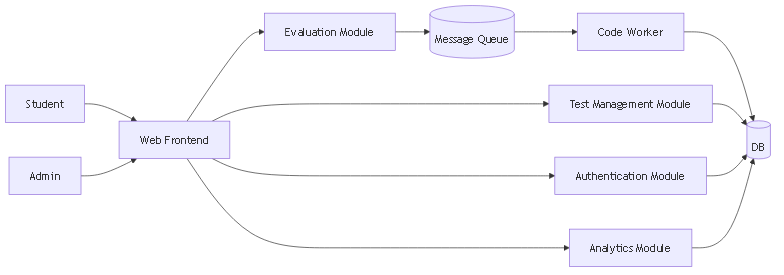
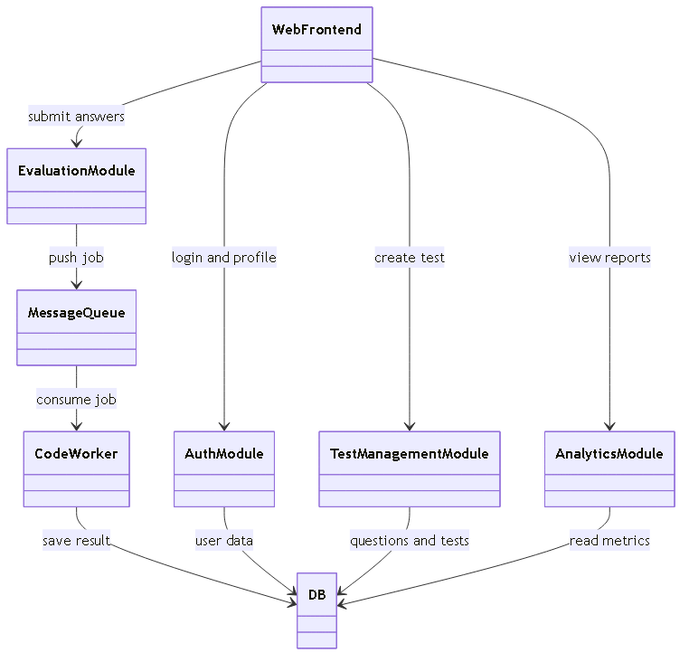

# Task 1: Requirements and Subsystems

## 1. Functional and Non Functional Requirements

### Functional Requirements
- FR1: The platform should allow students and admins to register, login and manage profile.
- FR2: Students should select topic, question type and difficulty to create custom practice test.
- FR3: System should create timed tests and avoid repeating same question for same user.
- FR4: Student code should run in isolated sandbox container so main server stays safe.
- FR5: After submission system should auto evaluate answers and show score in dashboard.
- FR6: Admin should add, edit and delete questions in question bank.

### Non Functional Requirements
- NFR1 Performance: Code evaluation result should come in 5 seconds for normal submissions. Pages should load in 2 seconds.
- NFR2 Scalability: System should handle 1000 concurrent submissions without major slowdown.
- NFR3 Security: Authentication should be token based. Code execution should have strict limits like 256 MB RAM and 1 CPU core.
- NFR4 Availability: Platform should maintain 99.5 percent uptime.
- NFR5 Usability: Student should start a test in 3 clicks without training.
- NFR6 Maintainability: System should be modular so one module change should not break others.

## 2. Architecturally Significant Requirements

### ASR1 Secure Code Execution
Student code is untrusted input. If we run it directly then one bad code can crash full app. So we must run code in sandbox container with CPU, memory and timeout limits.

### ASR2 Async Submission Processing
Code compile and run takes time. If API thread waits for it then all other requests become slow. So API should only push job to queue and worker should process in background.

### ASR3 Clear Modular Boundaries
Project timeline is short and team size is five students. So modular monolith is practical. We keep auth, test, evaluation and analytics in separate modules with clear boundaries.

### ASR4 Fast Student Feedback
Students need result quickly during practice. So queue wait time, worker speed and DB query speed are key architecture points.

## 3. Subsystem Overview

The platform is one modular monolith application with internal modules. Heavy code execution is moved to worker process through queue.

### 3.1 Web Application Module
- Web Frontend: Student and admin user interface.
- Authentication Module: Registration, login, token creation and access control.

### 3.2 Test Management Module
- Question Management: Add, update and remove coding, SQL and MCQ questions.
- Test Generation: Build timed test by topic, type and difficulty.

### 3.3 Evaluation Module
- Submission Evaluator: Detect submission type and call correct evaluator.
- Code Worker: Pick queued jobs and run code in sandbox container.
- SQL Evaluator: Run SQL answer on sample database and compare expected output.
- Message Queue: Hold jobs and smooth traffic spike.

### 3.4 Analytics Module
- Analytics Engine: Calculate score and weak topic trends.
- Student Dashboard: Show attempts, scores and progress.
- Admin Console: Show usage and performance reports.

### 3.5 Shared Data Layer
- DB: Store users, questions, tests, submissions and analytics data.

## 4. Diagrams

### 4.1 C4 Style Subsystem View

Diagram source: [diagrams/task1-c4-context.mmd](diagrams/task1-c4-context.mmd)

### 4.2 UML Module Relation View

Diagram source: [diagrams/task1-uml-modules.mmd](diagrams/task1-uml-modules.mmd)