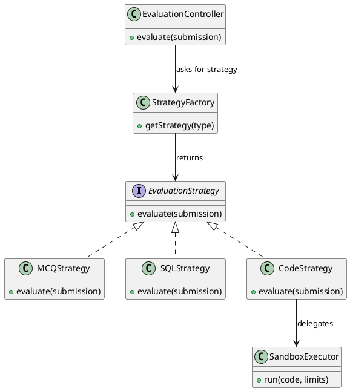
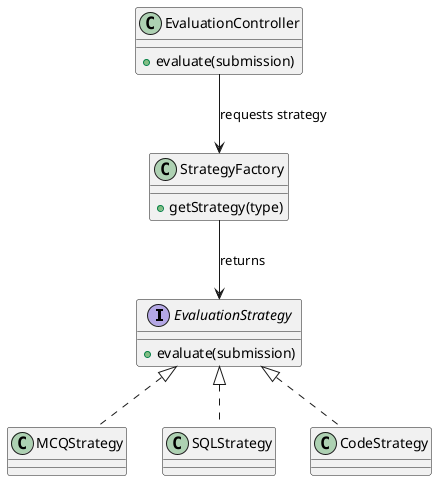
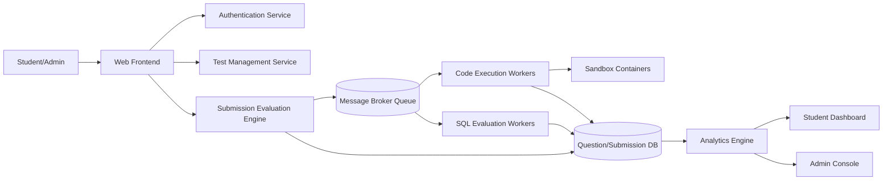
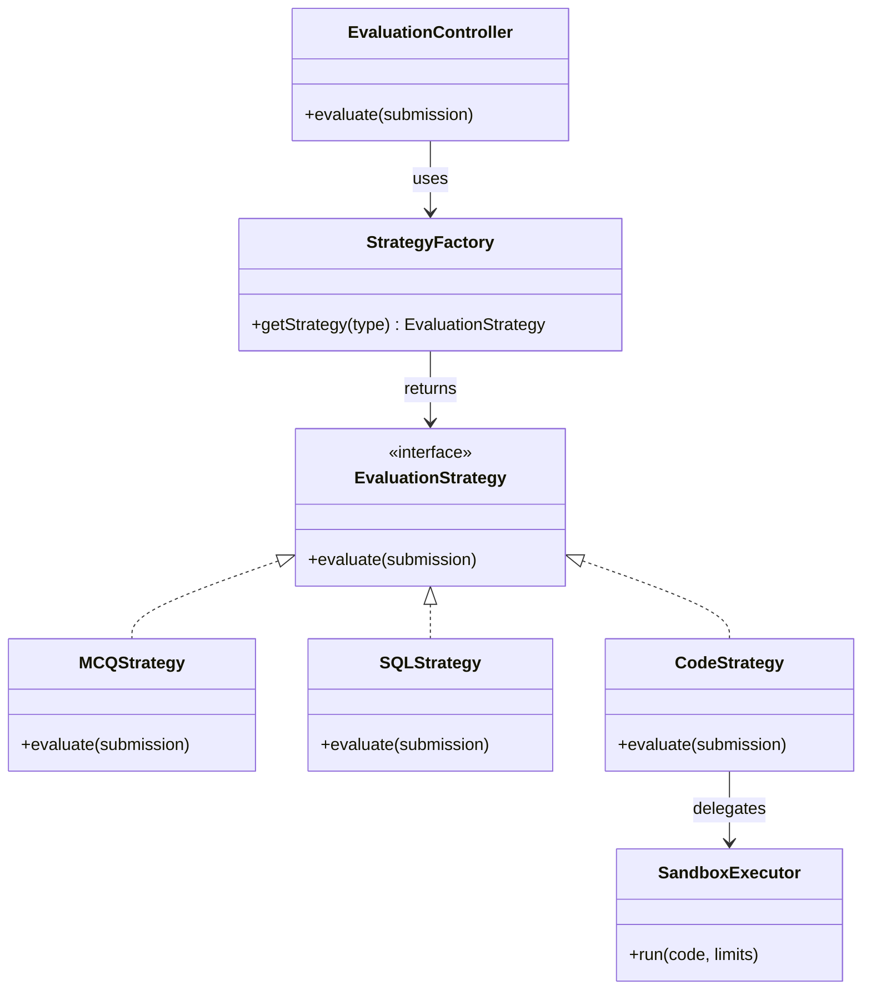

# Task 3: Architectural Tactics and Patterns

## 1. Goal and Scope

This document explains how the architecture will satisfy all six non-functional requirements (NFR1 to NFR6) for the coding practice platform. It includes:

- practical implementation details,
- recommended techniques,
- reasons each approach works,
- architectural tactics mapped to NFRs,
- two implementation patterns with diagrams.

---

## 2. Detailed Implementation Plan for All NFRs

### NFR1: Performance

Requirement:

- Code evaluation result within 5 seconds (normal submissions).
- Web pages should load within 2 seconds.

Implementation:

1. Use asynchronous evaluation pipeline.
- API accepts submission and quickly writes job to queue.
- Worker executes compile and run in background.
- Client polls status endpoint or receives websocket update.

2. Add caching at read-heavy points.
- Cache question metadata and topic lists in Redis.
- Cache frequently viewed dashboard summaries for short TTL (for example 30 to 60 seconds).

3. Optimize database layer.
- Add indexes on user_id, test_id, submission_id, created_at.
- Use pagination for history endpoints.
- Avoid N+1 queries in dashboard and analytics APIs.

4. Use pre-warmed worker pool.
- Keep a baseline number of workers and warm containers to reduce cold-start delay.

5. Introduce strict timeout budgets.
- API timeout budget for synchronous calls.
- Execution timeout for user code based on language profile.

Why this works:

- Queue decoupling prevents slow code execution from blocking user-facing APIs.
- Caching and indexed queries reduce average response time and tail latency.
- Warm workers reduce startup overhead, which is often a major part of end-to-end latency.

Verification metrics:

- p95 page/API latency <= 2 seconds.
- p95 submission evaluation completion <= 5 seconds for standard test sizes.
- Queue wait time p95 below target threshold during peak periods.

---

### NFR2: Scalability

Requirement:

- Handle 1000 concurrent submissions without major slowdown.

Implementation:

1. Horizontal scaling for stateless services.
- Run multiple API instances behind load balancer.
- Run multiple worker instances consuming the same queue.

2. Partitioned queue consumption.
- Use separate queues or routing keys by job type (code, SQL, MCQ).
- Isolate heavy jobs so they do not starve lighter jobs.

3. Auto-scaling policy.
- Scale workers based on queue depth, CPU load, and processing latency.
- Keep minimum worker replicas to absorb sudden spikes.

4. Database read and write tuning.
- Use connection pooling.
- Move heavy analytics to asynchronous aggregation jobs.

5. Backpressure control.
- Set queue length and per-user submission limits.
- Return graceful retry message if system is overloaded.

Why this works:

- Stateless service replicas can scale linearly with traffic.
- Queue-based work distribution smooths burst traffic and avoids collapse.
- Backpressure protects core services from overload and cascading timeouts.

Verification metrics:

- Throughput target of 1000 concurrent submissions with acceptable p95 latency.
- Worker utilization within safe range (for example 60% to 80% sustained).
- No significant increase in error rate under stress test.

---

### NFR3: Security

Requirement:

- Token-based authentication.
- User code must run in sandbox with limits (for example 256MB RAM and 1 CPU core).

Implementation:

1. Authentication and authorization hardening.
- Use JWT access tokens with short expiry and refresh token rotation.
- Enforce role-based access control for admin-only operations.

2. Password and session security.
- Hash passwords using Argon2 or bcrypt.
- Store refresh tokens securely and revoke on logout.

3. Secure sandbox execution.
- Run user code in isolated containers with:
  - memory limit 256MB,
  - CPU quota 1 core,
  - execution timeout,
  - read-only filesystem where possible,
  - network disabled unless explicitly needed.

4. Rate limiting and abuse prevention.
- Limit login attempts per user and IP.
- Limit submission frequency per user.

5. Input validation and audit logging.
- Validate payload schema on every endpoint.
- Record critical events: login, admin actions, submission evaluations, failed authorization.

Why this works:

- Token security and RBAC reduce unauthorized access risk.
- Sandboxing contains untrusted code and prevents host-level compromise.
- Rate limiting and validation block common abuse patterns such as brute-force and flooding.

Verification metrics:

- 100% protected endpoints require valid token and role checks.
- 100% code jobs executed under enforced resource limits.
- Security logs capture all critical auth and admin events.

---

### NFR4: Availability

Requirement:

- Platform should maintain 99.5% uptime.

Implementation:

1. Redundant deployment.
- Multiple API and worker instances across failure domains.
- Health probes for automatic restart of unhealthy instances.

2. Retry with exponential backoff and jitter.
- Apply bounded retries only for transient failures.

3. Circuit breaker on unstable dependencies.
- Open circuit after threshold failures.
- Return fallback response quickly instead of waiting for repeated timeouts.

4. Graceful degradation.
- If analytics service is down, core test and submission flow still runs.
- Show delayed analytics notice rather than total outage.

5. Backup and recovery plan.
- Automated database backups.
- Regular restore drills and runbooks for incident response.

Why this works:

- Redundancy eliminates single point failures for critical paths.
- Circuit breaker plus retry policy prevents cascading failures.
- Graceful degradation preserves core business functionality even during partial outages.

Verification metrics:

- Monthly uptime >= 99.5%.
- Mean time to recovery (MTTR) within target.
- Successful periodic restore tests from backup.

---

### NFR5: Usability

Requirement:

- Student should be able to start a test in 3 clicks with no training.

Implementation:

1. Simplified user journey.
- Keep critical flow as: select test config -> start test -> begin answering.
- Remove non-essential form fields from start flow.

2. Consistent information architecture.
- Clear section grouping: Practice, History, Profile.
- Same interaction pattern across student and admin panels.

3. Fast and clear feedback.
- Inline form validation with plain-language error messages.
- Loading and status indicators for long operations.

4. Accessibility baseline.
- Keyboard navigation support, readable contrast, meaningful labels.
- Responsive layout for laptop and mobile screens.

5. Lightweight user testing.
- Run task-based tests with first-time users.
- Track confusion points and reduce clicks/steps.

Why this works:

- Reducing cognitive load and interaction steps increases completion rate.
- Immediate feedback lowers user error and frustration.
- Accessibility improvements help all users, not only users with specific needs.

Verification metrics:

- New user test-start success rate >= 90%.
- Average clicks to start test <= 3.
- Reduced drop-off between login and first submission.

---

### NFR6: Maintainability

Requirement:

- System should be modular so one module can be changed with minimal impact on others.

Implementation:

1. Modular service boundaries.
- Separate services for auth, test management, evaluation, analytics.
- Inter-service communication through stable API contracts and queue messages.

2. Layered code structure in each service.
- Controller layer, service layer, repository layer.
- Keep business logic out of controllers.

3. Contract-first integration.
- Versioned API schemas and message contracts.
- Backward-compatible changes by default.

4. Automated quality gates.
- Unit tests for business logic.
- Integration tests for cross-service communication.
- Linting and static analysis in CI.

5. Documentation and observability.
- Architecture decision records for major design choices.
- Structured logs, traces, and service-level dashboards.

Why this works:

- Clear boundaries reduce side effects when changing one module.
- Contract-first design lowers integration break risk.
- Tests and CI catch regressions before deployment.

Verification metrics:

- Change failure rate below target.
- Reduced lead time for feature updates.
- High unit and integration test pass rates.

---

## 3. Architectural Tactics (4 to 5)

### Tactic 1: Asynchronous Processing with Message Queue

- Description: Submission evaluation jobs are published to a queue and processed by workers.
- Addresses: NFR1 (performance), NFR2 (scalability), NFR4 (availability).
- Why it is effective: Decouples request handling from heavy computation and smooths traffic spikes.

### Tactic 2: Sandboxing with Resource Isolation

- Description: Execute user code in isolated containers with strict CPU, memory, filesystem, and timeout controls.
- Addresses: NFR3 (security), NFR4 (availability).
- Why it is effective: Contains untrusted code and prevents one bad job from affecting host stability.

### Tactic 3: Caching and Data Access Optimization

- Description: Cache hot read paths and optimize database with indexes and query tuning.
- Addresses: NFR1 (performance), NFR2 (scalability).
- Why it is effective: Reduces expensive repeated work and protects database under load.

### Tactic 4: Retry + Circuit Breaker + Health Monitoring

- Description: Add bounded retries for transient failures, circuit breakers for unstable services, and automatic health checks.
- Addresses: NFR4 (availability), NFR2 (scalability under fault conditions).
- Why it is effective: Prevents cascading failure and improves recovery behavior.

### Tactic 5: Modular Service Decomposition with Stable Contracts

- Description: Keep subsystems independent and communicate via APIs and message contracts.
- Addresses: NFR6 (maintainability), NFR2 (scalability), NFR5 (usability through faster feature iteration).
- Why it is effective: Supports independent deployment, easier testing, and safer change isolation.

---

## 4. Implementation Patterns (2)

### Pattern 1: Strategy Pattern

Role in architecture:

- The Submission Evaluation Engine acts as the context that selects the correct evaluation algorithm at runtime.
- MCQ, SQL, and Code evaluation are kept in separate strategy classes.
- This lets the system route each submission type to the right logic without changing the main evaluator.
- In practice, it keeps the evaluation subsystem open for extension when a new question type is added.

Why this pattern:

- Prevents large if-else branches.
- Makes adding new evaluation types easy without modifying existing evaluator flow.
- Improves testability by isolating each evaluation algorithm.

PlantUML diagram:

### Pattern 2: Factory Method Pattern

Role in architecture:

- The factory centralizes object creation for evaluators and executors.
- The controller does not need to know which concrete class to instantiate.
- If a new language or evaluator is added, only the factory mapping changes, not the controller flow.
- This keeps creation logic in one place and supports dependency inversion.

Why this pattern:

- Centralizes creation logic and keeps controller code clean.
- Reduces coupling and supports extension for new languages and evaluators.

PlantUML diagram:

---

## 5. Architectural Patterns Implemented in This System

This section uses the architectural pattern names from the syllabus summary and maps them to this project.

### 5.1 Client-Server Pattern

How it is used:

- Student and admin clients (browser UI) send requests to backend API services.
- Backend services return data, auth tokens, and evaluation status.

Why this is a good fit:

- Clear separation between user interface and core business logic.
- Easy to support multiple clients (web now, mobile later) with the same server APIs.

Primary NFR impact:

- NFR5 (usability), NFR6 (maintainability), NFR2 (scalability).

### 5.2 Layered Architecture Pattern

How it is used:

- Each service follows Presentation/API -> Business Service -> Data Access layers.
- Validation and transport concerns stay in API layer; business rules stay in service layer; persistence stays in data layer.

Why this is a good fit:

- Limits ripple effects when making changes.
- Improves readability, testing, and team ownership of code.

Primary NFR impact:

- NFR6 (maintainability), NFR3 (security policy enforcement points), NFR1 (performance via focused data-access optimization).

### 5.3 MVC Pattern (Frontend Application)

How it is used:

- View: dashboard and test UI components.
- Controller: UI actions and request handlers (submit, next question, start test).
- Model: client-side state and API response models.

Why this is a good fit:

- Keeps UI rendering separate from interaction logic.
- Makes the student flow easier to evolve without breaking data handling.

Primary NFR impact:

- NFR5 (usability), NFR6 (maintainability).

### 5.4 Publish-Subscribe / Event-Driven Pattern

How it is used:

- Submission-created event is published to message broker.
- Evaluation workers subscribe, process jobs, and publish completion/result events.

Why this is a good fit:

- Decouples heavy evaluation from synchronous user requests.
- Handles burst load better than direct request-to-worker calls.

Primary NFR impact:

- NFR1 (performance), NFR2 (scalability), NFR4 (availability).

### 5.5 Modular Monolith Pattern

How it is used:

- The entire application is built as a single deployable unit but is internally divided into clearly separated modules: auth, questions, tests, evaluation, and analytics.
- Each module has its own folder with its own routes, controllers, services, and data access layer.
- Modules communicate through internal function calls and events, not through network calls.
- No module directly accesses another module's database tables or internal files.

Why this is a good fit:

- Avoids the operational complexity of microservices (no service discovery, no distributed transactions, no inter-service networking) which is appropriate for our team size of five students and a four week timeline.
- Module boundaries are clean and well-enforced through code review, so if the system needs to be split into separate services in the future the boundaries are already in place.
- A single deployment process makes the system easy to run, test, and debug locally.
- Team members can work on separate modules in parallel with minimal risk of merge conflicts.

Primary NFR impact:

- NFR6 (maintainability), NFR2 (scalability through clean module separation), NFR4 (availability through simplified deployment and reduced failure surface).

---

## 6. Diagrams

### 6.1 C4-Style Container View (Mermaid)

### 6.2 UML Class Diagram (Strategy + Factory)

---

## 7. NFR to Tactic Traceability Matrix

| NFR | Main Tactics | Supporting Patterns |
|---|---|---|
| NFR1 Performance | Async queue, caching, DB optimization | Strategy (efficient routing) |
| NFR2 Scalability | Horizontal scaling, queue partitioning, backpressure | Factory (runtime flexibility) |
| NFR3 Security | Sandbox isolation, token auth, rate limiting | Strategy (type-specific security checks) |
| NFR4 Availability | Redundancy, retry, circuit breaker, health checks | Factory (fallback creation paths) |
| NFR5 Usability | Simplified flows, consistent UI, fast feedback | Strategy (clear evaluation behavior per type) |
| NFR6 Maintainability | Modular decomposition, stable contracts, CI tests | Strategy + Factory (low coupling, extensibility) |

---

## 8. Recommended Implementation Order

1. Build secure auth plus sandbox baseline first (NFR3).
2. Add asynchronous queue pipeline and worker pool (NFR1, NFR2).
3. Add reliability controls: retry, circuit breaker, health checks (NFR4).
4. Optimize read paths with caching and indexing (NFR1, NFR2).
5. Improve usability flow and run lightweight user testing (NFR5).
6. Strengthen maintainability with contract tests, CI gates, and documentation (NFR6).

This order gives early risk reduction (security), then capacity and speed, then resilience and long-term code quality.