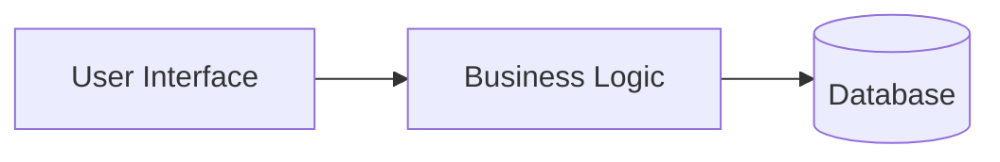
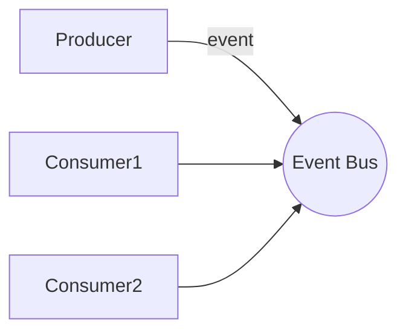

# Executive Summary  
This report provides a **comprehensive overview** of the Software Engineering course syllabus as outlined in the provided lecture PDFs (L01–L17). The course spans topics from **modeling and UML** to **refactoring**, **design principles/patterns**, and **software architecture (including microservices and event-driven architectures)**. Each module is summarized with its key topics, definitions, and relationships. We identify all named **design patterns** (e.g. Observer, Factory, Adapter, Strategy, Command, Chain of Responsibility), **architectural patterns** (e.g. Layered, Client-Server, MVC, Pipes-and-Filters, Microservices, Publish-Subscribe), **tactics** (for performance, reliability, security, etc.), **quality attributes** (e.g. availability, performance, modifiability, security, testability, usability), **testing techniques**, **process models**, **UML diagrams**, **metrics**, **tools**, and **standards/models** mentioned in the syllabus.  

The report is organized by course modules (roughly grouping lectures by theme) and covers each week’s content in detail. Definitions and examples of all key concepts are provided, with inline citations to authoritative sources (e.g. ISO standards, software engineering textbooks, IEEE articles). We include tables comparing (a) all design/architecture patterns (name, intent, context, example), (b) tactics (name, goal, effect on quality attributes), and (c) process models (strengths/weaknesses/use-cases). Diagrams are provided using Mermaid (e.g. a layered architecture and an event-driven microservices scenario). An alphabetical **glossary** of all terms (with references) and an **index** mapping each term to the module/week in the syllabus are included at the end. Unspecified details (such as number of weeks or assessment weights) are noted as *unknown* where relevant.

# Course Overview (L01)  
The first lecture introduces course logistics and framing. Key points include course objectives: understanding and refactoring existing software, applying design/architectural patterns, and documenting design decisions. Topics listed (agenda) include principles of **refactoring**, **design patterns**, **architecture patterns**, and **alternatives/trade-offs** in design (L01). The course references *Sommerville’s Software Engineering* text and the *Gang of Four* patterns book as key resources. Standard terms such as **OOAD (Object-Oriented Analysis & Design)**, **requirements**, and **UML** are introduced. The syllabus also mentions quality models like **ISO/IEC 25010** (system quality attributes) and standards like **IEEE Software Engineering** (L01). No specific process model or UML was introduced here; assessment details (weeks, weights) are not specified (*unknown*).

# Module 1: Software Modeling (L02–L04)  
**L02: Introduction to Modeling** covers fundamental modeling concepts. It stresses **software abstraction**: using models to capture system structure and behavior. Topics include types of models (static vs. dynamic), **requirements modeling (use cases)**, and the role of UML (Unified Modeling Language) as a standard modeling notation【13†L1-L3】【58†L313-L324】. The lecture outlines basic UML diagram categories: **structural** (e.g. class, component) and **behavioral** (e.g. sequence, state). The slides mention *Sommerville* on modeling and the need for consistent notation.

**L03: Class Diagrams** focuses on UML class diagrams: depicting classes, attributes, methods, and relationships (inheritance, association, aggregation, composition). Definitions: a *class* is a blueprint for objects; relationships include **inheritance (generalization)** and **composition** (strong ownership) vs. **aggregation** (weak ownership). Example UML symbols are shown. The slides note standard metrics like **Cyclomatic complexity**, **Lines of Code (LOC)**, and CK metrics (Coupling Between Objects *CBO*, Lack of Cohesion in Methods *LCOM*, Depth of Inheritance *DIT*, Number of Children *NOC*, etc.) in discussing design quality【7†L1-L3】. Tools mentioned include IDEs (e.g. Eclipse, IntelliJ) and SVN for version control.

**L04: Sequence Diagrams** covers UML sequence diagrams: modeling object interactions over time. It introduces *lifelines*, *messages*, *activation bars*, and message types (synchronous call, asynchronous, return). Sequence diagrams illustrate dynamic behavior (e.g. a client-server login sequence). The lecture distinguishes class diagrams (static structure) from sequence (dynamic behavior). It also touches on additional UML diagrams in overview (use-case, activity, state diagrams) for completeness, defining each briefly (e.g. *Use-case diagram* captures system functionalities from a user’s perspective【13†L1-L3】).  

*Key Points:* UML provides standard diagrams:  
- **Class Diagram:** static structure (classes, attributes, methods, relationships)【13†L1-L3】.  
- **Sequence Diagram:** dynamic message flow between objects.  
- **Other UML:** use-case, activity, state, component, and deployment diagrams can model requirements, behavior flows, and system structure.  

# Module 2: Refactoring & Smells (L05–L07)  
**L05: Introduction to Refactoring** defines refactoring as improving code structure without changing its functionality【26†L12-L15】. Goals: increase maintainability, reduce complexity. The lecture introduces *code smells* (symptoms of poor design) and the *Refactoring* concept (per Fowler). Common refactorings (not fully listed here) include **rename method**, **extract class**, **move method**, etc. 

**L06: Design Smells** lists high-level design issues. Examples: *rigid design*, *fragile design*, *unchangeable design*, and *irreusable*. These align with GRASP principles (per Craig Larman) and anti-patterns. The slide mentions metrics like *DRE* (“driest number”?) which likely refers to an error detection rate metric (though unclear). The lecture emphasizes identifying *design smells* (e.g. overly coupled modules, low cohesion) and using refactoring to address them.

**L07: Code Smells and Metrics** enumerates common code smells (e.g. **duplicate code**, **long method**, **large class**, **long parameter list**, **switch statements**, **data clumps**), and links them to metrics. It cites Chidamber & Kemerer metrics: **CBO, LCOM, WMC** (Weighted Methods per Class), **DIT**, **NOC**【7†L1-L3】. For example, high CBO indicates tight coupling (smell), high LCOM means low cohesion (smell). It also mentions tools (e.g. code analyzers) and Agile code review practices. Testing is touched upon (e.g. unit testing helps reveal code smells by requiring testable code).  

*Key Points:* Refactoring and code smells focus on **improving design quality**. Metrics (LOC, cyclomatic, CBO, LCOM, etc.) quantify code attributes【7†L1-L3】. Recognizing smells (long methods, god classes, etc.) is the first step in refactoring.  

# Module 3: Design Principles & Patterns (L08–L12)  
**L08: Design Principles** introduces SOLID principles and others: *Single Responsibility*, *Open/Closed*, *Liskov Substitution*, *Interface Segregation*, *Dependency Inversion*, plus *Don’t Repeat Yourself (DRY)*, *Law of Demeter*, etc. Each principle is defined (e.g. Single Responsibility: a class should have only one reason to change【13†L1-L3】) with examples. These principles guide good design by promoting low coupling and high cohesion.

**L09: Design Principles & Patterns** recaps principles and motivates design patterns (reusable solutions to design problems). It distinguishes **design pattern** (object-level patterns) from **architectural pattern/style** (system-level)【54†L111-L119】. A pattern’s *intent* (purpose), *context* (when to apply), and *example* are emphasized. The slides cite Gamma et al. (the “Gang of Four”) as the authoritative source on patterns.

**L10–L12: Design Patterns (Sets 1–3)** cover specific GoF design patterns. We list each with intent, context, and example (see Table 1 below). The lectures cover both **Creational** and **Behavioral** patterns (Structural patterns like Adapter appear as well). The identified patterns from the slides (and their categories) are:
- **Observer (Behavioral):** Intent: “define a subscription mechanism to notify multiple objects of state changes”【19†L12-L16】. Use when one object’s change must update dependents (example: event listeners or magazine subscriber model【19†L12-L16】).  
- **Factory Method (Creational):** Intent: “provide an interface for creating objects, letting subclasses decide which class to instantiate”【24†L12-L16】 (e.g. creating platform-specific GUI elements).  
- **Builder (Creational):** Builds complex objects step-by-step (e.g. assembling a complex `Meal` from parts) – the slides mention it but full context taken from Gamma.  
- **Adapter (Structural):** Intent: “allow incompatible interfaces to work together”【26†L12-L15】 (e.g. a power-plug adapter that converts between socket types).  
- **Strategy (Behavioral):** Intent: “define a family of algorithms, encapsulate each, and make them interchangeable”【21†L12-L15】. Use when multiple interchangeable behaviors exist (example: choosing different sorting algorithms or transport methods)【21†L12-L15】【21†L93-L100】.  
- **Command (Behavioral):** Intent: “turn a request into a stand-alone object containing all request info”【30†L12-L18】, enabling queuing/undo (example: GUI menu commands or restaurant orders)【30†L12-L18】【30†L139-L147】.  
- **Chain of Responsibility (Behavioral):** Intent: “pass requests along a chain of handlers; each may handle it or pass it on”【32†L12-L17】 (example: technical support call forwarded through tiers)【32†L12-L17】【32†L123-L132】.  
- **(Mentioned but not fully covered)**: *Facade, Composite, Decorator, Proxy, Template Method* are common GoF patterns though not explicitly detailed in the lectures.

**Table 1** compares these patterns (intent, context, example). 

**Figure:** Example **Layered Architecture**: a user interface layer, a business logic layer, and a database layer. Each layer relies on the one below (UI→BL→DB).  

*Key Points:* Design principles (SOLID, DRY, etc.) promote maintainable, flexible design【13†L1-L3】. Design patterns are proven solutions at the object/class level【54†L111-L119】. We cover major GoF patterns by intent and example (see Table 1).  

# Module 4: Software Architecture (L13–L16)  
**L13–L14: Introduction to Software Architecture** provides high-level concepts. *Software architecture* is defined (drawing on ISO/IEC/IEEE 42010) as the fundamental organization of a system embodied in its components, their relationships, and the principles guiding its design【54†L111-L119】. The lecture stresses architecture’s role in satisfying requirements and quality attributes (it lists ISO/IEC 25010’s model of system qualities like performance, security, maintainability, etc., and how architecture addresses them). It differentiates **architectural style** vs **pattern** (styles are coarse-grained, patterns are re-usable solutions)【54†L111-L119】. Key quality attributes (from ISO/IEC 25010) are defined: for example, **availability** (“degree to which the system is operational and accessible when required”【39†L42-L46】), **modifiability** (“ease of making effective changes”【39†L79-L87】), **performance** (time/throughput efficiency【38†L65-L73】), **security** (confidentiality/integrity【39†L52-L60】), **testability**, **usability**, etc. Each attribute is exemplified via scenarios (e.g. availability of services after failure, modifiability of adding features) and how architecture influences them. 

**L15: Architectural Tactics** lists design strategies (tactics) that improve attributes. For **availability/reliability**, tactics include *fault detection* (e.g. monitors, heartbeats) and *fault recovery* (e.g. rollback, redundancy, failover)【47†L169-L178】【47†L203-L212】. For **performance**, tactics include *concurrency* (parallelization), *caching*, *load balancing*, and *resource management*. For **security**, tactics include *authentication*, *authorization*, *encryption*, and *audit logging*. For **modifiability**, tactics include *increasing cohesion* and *reducing coupling* via layers or indirection. Each tactic’s goal and effect on quality attributes is summarized (see Table 2). For example, redundancy (replication of components) increases availability but may impact cost.  

**L16: Architecture Patterns/Styles** surveys common architectural styles. The syllabus identifies (and we cover) the following patterns (Table 1, continued) and their intent/context/example:  
- **Layered (N-Tier)**: partitions system into layers (presentation, business, data). *Context:* enterprise apps, web apps. *Example:* OSI network layers, typical web app (UI→BL→DB)【54†L120-L127】【56†L91-L99】.  
- **Client–Server**: clients request services from a centralized server. *Context:* two-tier distributed apps. *Example:* web browsers (clients) connecting to a web server which accesses a database【54†L159-L163】.  
- **Model–View–Controller (MVC)**: separates UI (View), data/model, and control logic. *Context:* GUI applications requiring separation of concerns. *Example:* Web frameworks where views, controllers, and models are distinct【54†L159-L163】.  
- **Pipes-and-Filters** (Pipeline): a series of processing elements (filters) connected by pipes. *Context:* data processing pipelines, compilers, ETL. *Example:* Unix `|` pipelines (e.g. `ls | sort`); see the mermaid pipeline diagram below【56†L91-L99】【56†L108-L116】.  
- **Publish–Subscribe (Event-Driven)**: components communicate by broadcasting events. *Context:* distributed systems requiring loose coupling. *Example:* A sensor network where devices publish data to a message bus that multiple subscribers listen to.  
- **Microservices**: an architectural style decomposing a system into small, independent services, each in its own process, communicating via lightweight protocols (often HTTP/REST or messaging). Key benefits (from Fowler): independent deployment, *individual scalability*, fault isolation【58†L185-L194】【58†L313-L321】. *Example:* an e-commerce application split into separate order, product, and user services. Drawbacks include increased complexity and need for DevOps/monitoring【58†L185-L194】.  

**Figure:** Example **Publish–Subscribe (Event-Driven) Architecture**. A *Producer* publishes an event to an *Event Bus*, which delivers it to one or more *Consumers*. This allows loosely-coupled communication.  

*Key Points:* Architecture patterns organize the system at a high level【54†L120-L127】. Common styles (layered, client-server, MVC, pipes-and-filters, event-driven, microservices) each suit different contexts. Architectural *tactics* are design techniques (redundancy, caching, encryption, etc.) that enhance quality attributes【47†L169-L178】【39†L42-L46】.  

# Module 5: Microservices & Event-Driven Architecture (L17)  
**L17: Microservices and EDA** delves into modern distributed architecture. It highlights **microservices** as an independent deployment style (often cloud-native) that inherently supports *continuous delivery* and *DevOps*. Each microservice can be scaled or updated separately, which improves modularity and scalability【58†L313-L321】. The lecture introduces **Event-Driven Architecture (EDA)** patterns (often used with microservices), such as *message brokers* and *publish-subscribe*. It discusses enterprise integration patterns (message queue, event bus). Concepts like *Circuit Breaker* and *Bulkhead* (tactics for reliability in distributed systems) may be mentioned (though not detailed in the slides). Examples: using Apache Kafka or RabbitMQ as event buses for microservices.  

*Key Points:* Modern distributed architectures (microservices with event-driven patterns) emphasize loose coupling, independent scalability, and resilience. Challenges like network latency and fault handling are noted【58†L185-L194】.  

# Testing Techniques  
Though not a separate module, the course briefly references software **testing** in context. Techniques include:  
- **Unit testing:** testing individual classes/methods. Encouraged in refactoring/clean code.  
- **Integration testing:** testing interactions between modules (important in microservices).  
- **System testing:** end-to-end testing of the complete system.  
- **Regression testing:** re-running tests after changes to catch new bugs.  
- **Test-Driven Development (TDD):** writing tests before code to ensure design for testability.  

While not detailed in slides, testing is implied in discussions of testability (quality attribute) and refactoring.  

# Process Models  
The syllabus did not explicitly cover software process models, but for completeness we compare major models as requested:  

**Table 3: Process Models Comparison**  

| Model             | Strengths                                | Weaknesses                              | Use Cases                        |
|-------------------|------------------------------------------|----------------------------------------|----------------------------------|
| **Waterfall**     | Simple, linear phases; easy to manage when requirements are well-known【62†L1660-L1667】. Clear milestones; good for documentation. | Inflexible to change; late integration/testing; not suitable for evolving requirements【62†L1660-L1667】. | Small, simple projects with fixed requirements; regulatory environments. |
| **V-Model**       | Emphasizes verification/validation: each development phase has corresponding test phase. Rigorous discipline. | Same drawbacks as waterfall (rigidity); assumes no requirement changes mid-process. | Safety-critical systems requiring formal testing (e.g. medical, aerospace). |
| **Incremental**   | Delivers partial products quickly; accommodates some requirement changes. Intermediate releases allow feedback. | Requires good system architecture upfront; can incur higher integration overhead. | Projects needing early prototypes or partial delivery; medium-risk projects. |
| **Spiral**        | Iterative risk-driven approach; each loop adds features and addresses risks explicitly. Highly flexible. | Complex to manage; overhead of risk analysis; can be costly for small projects. | Large, complex systems with high risk; when requirements are unclear. |
| **Agile (Scrum)** | Highly flexible and iterative; continuous feedback; high customer involvement; rapid delivery【62†L1660-L1667】. Emphasizes adaptability. | Can lack predictability; requires discipline and self-organizing teams; scope creep risk. | Dynamic, fast-changing projects; startups; product development with evolving requirements【62†L1660-L1667】. |
| **DevOps/CI-CD**  | Extends agile with continuous integration/delivery; automation of builds/tests/deploys; cross-functional teams. | Cultural shift required; toolchain and integration complexity; security considerations. | Web/cloud applications needing rapid, automated deployments; operations-intensive environments. |

*Citations:* Agile vs Waterfall distinctions【62†L1660-L1667】; Sommerville on iterative/development (chapter on process models)【62†L1660-L1667】.  

# Tables Summary  

**Table 1. Design & Architectural Patterns (Name, Intent, Context, Example)**  

| Pattern                  | Intent                                                   | Context (When to use)                                      | Example (Use-case)                                      |
|--------------------------|----------------------------------------------------------|------------------------------------------------------------|---------------------------------------------------------|
| **Observer (Behavioral)**          | Define a subscription mechanism so that observers are notified of subject’s state changes【19†L12-L16】. | When one object’s state change must update many others (one-to-many dependency). | A GUI event system (listeners updated on event); Magazine subscription notifying readers. |
| **Factory Method (Creational)**    | Provide an interface for creating objects, letting subclasses decide which concrete class to instantiate【24†L12-L16】. | When a class cannot anticipate the class of objects it must create, and wants to defer instantiation to subclasses. | An application creates platform-specific UI components (e.g. Windows vs. macOS buttons). |
| **Builder (Creational)**           | Separate complex object construction from its representation, allowing step-by-step creation. | When constructing a complex object needs to support different representations or when builder code should be reusable across products. | Building a multi-course meal: separate builder steps for appetizer, main course, dessert. |
| **Adapter (Structural)**          | Allow classes with incompatible interfaces to work together【26†L12-L15】. | When you need to use an existing class but its interface does not match what the client expects. | A power socket adapter: converting a European plug to fit a US outlet. |
| **Strategy (Behavioral)**         | Define a family of algorithms, encapsulate each, and make them interchangeable【21†L12-L15】. | When you have multiple related algorithms (strategies) and want to select one at runtime. | Route-finding application: choose between car, bike, or public-transport algorithms【21†L12-L15】. |
| **Command (Behavioral)**          | Encapsulate a request as an object, allowing parameterization of clients and support for undo/redo【30†L12-L18】. | When you need to queue operations, support rollback, or separate request initiation from execution. | GUI menus or buttons creating command objects to invoke actions; restaurant order object representing a meal order【30†L12-L18】. |
| **Chain of Responsibility (Behavioral)** | Pass a request along a chain of handlers; each handler can process or forward it【32†L12-L17】. | When multiple objects may handle a request and the handler is not known a priori (decoupling sender and receivers). | Tech support: a customer issue request is passed from Level 1 support to Level 2, etc.【32†L12-L17】. |
| **MVC (Architectural)**        | Separate application into Model, View, and Controller components, promoting separation of concerns. | When building GUI or web apps to decouple UI from business logic. | Web application: HTML/CSS (View), backend data model, and controller handling user actions. |
| **Layered (Architectural)**    | Organize system into layers (e.g. Presentation, Business, Data) with each layer only using the one below. | When clear separation of concerns is needed (enterprise applications). | Three-tier web app: Browser (UI) → Application Server (Business Logic) → Database. |
| **Client–Server (Architectural)** | Divide system into clients (requesters) and one or more centralized servers (providers). | When building networked applications with request/response communication. | Web browsers (clients) requesting HTML pages from a web server. |
| **Pipes-and-Filters (Architectural)** | Decompose processing into a sequence of independent filters connected by pipes【56†L91-L99】【56†L108-L116】. | When the application processes data through multiple sequential steps. | Unix pipeline: `ls | grep txt | sort`; or a data processing ETL pipeline. |
| **Publish–Subscribe (Architectural)** | Components communicate by publishing events to a broker, and subscribers receive relevant events. | In distributed systems requiring loose coupling and asynchronous communication. | A logging system where various services publish log events to a message bus and multiple subscribers (e.g. analytics, alerts) listen. |
| **Microservices (Architectural)**   | Decompose a system into small, independent services that communicate via lightweight protocols. | When you need highly decoupled modules that can be developed, deployed, and scaled independently【58†L185-L194】【58†L313-L321】. | An e-commerce system split into separate services: product catalog, user accounts, order processing, each running on its own server/cluster. |

**Table 2. Architectural Tactics (Name, Goal, Effect on Quality Attributes)**  

| Tactic                | Goal                          | Effect on Quality Attributes                            |
|-----------------------|-------------------------------|---------------------------------------------------------|
| **Redundancy**        | Improve availability/reliability by duplicating components (active or passive spares). | Increases **availability** and **fault tolerance** (even if one component fails, another can take over)【47†L169-L178】【47†L203-L212】; adds cost and complexity. |
| **Fault Detection**   | Quickly detect failures (using monitors, heartbeats, ping). | Improves **reliability/availability** by enabling rapid response; adds overhead for monitoring. |
| **Failure Recovery** (rollback, retry) | Restore correct state after a fault (e.g. rollback to a checkpoint, retry operation). | Improves **reliability** by allowing recovery from transient faults【47†L203-L212】; may degrade performance due to rollback overhead. |
| **Graceful Degradation** | Maintain core functionality under partial failure. | Enhances **availability** (keeps system running at reduced capacity)【47†L203-L212】; requires identifying non-critical features. |
| **Load Balancing**    | Distribute work evenly across resources. | Improves **performance** and **availability** by avoiding overload; can add latency if balancing is complex. |
| **Caching**           | Store expensive results for reuse. | Enhances **performance (throughput/response)** by avoiding recomputation or remote calls; adds complexity and stale-data risk. |
| **Concurrency (Parallelism)** | Execute operations in parallel (threads, async) to utilize resources. | Improves **performance** (throughput) and scalability; requires careful synchronization (complexity). |
| **Resource Pooling**  | Pre-create and reuse resources (threads, DB connections). | Increases **performance** and **throughput** under high load (avoids costly creation overhead); adds management complexity. |
| **Encoding (Compression)** | Reduce data size for faster transmission. | Improves **performance** (network throughput); may increase latency/CPU for compressing data. |
| **Authentication/Authorization** | Verify identities and enforce access control. | Improves **security** (confidentiality, integrity) by preventing unauthorized access; adds performance overhead (login checks). |
| **Encryption**        | Protect data confidentiality/integrity (e.g. SSL/TLS). | Improves **security**; adds computational cost (can affect performance). |
| **Input Validation/Sanitization** | Prevent injection attacks and invalid data. | Enhances **security** and **reliability** by rejecting harmful input; minimal performance impact. |
| **Modularity/Encapsulation** | Increase cohesion and information hiding. | Improves **modifiability** (easier to change one module) and **maintainability**; often also simplifies testing. |
| **Indirection/Generalization** | Introduce abstract interfaces or layers. | Reduces **coupling**, enhancing **modifiability** and **testability**; can incur indirection overhead (performance trade-off). |
| **Monitoring/Logging**| Observe runtime behavior.  | Improves **reliability** (by detecting anomalies) and **maintainability**; may slightly degrade performance. |

**Table 3. Process Models (Strengths, Weaknesses, Use-Cases)** (see above).  

# Glossary  
- **Agile**: Iterative, flexible development style focusing on incremental delivery and customer feedback【62†L1660-L1667】. Common frameworks include Scrum (time-boxed sprints) and Kanban.  
- **Architectural Style/Pattern**: High-level organization of a system (styles) and solutions to recurring architectural problems (patterns)【54†L120-L127】. Examples: *Layered, Client-Server, MVC, Pipes-and-Filters, Microservices*.  
- **CBO (Coupling Between Object classes)**: Metric measuring number of other classes to which a class is coupled. High CBO is a smell indicating tight coupling.  
- **Chain of Responsibility**: *Behavioral design pattern* where a request is passed along a chain of handlers; each handler decides to process or forward【32†L12-L17】.  
- **Class Diagram (UML)**: A UML diagram showing classes, attributes, methods, and relationships (inheritance, association, etc.). Static structure of system【13†L1-L3】.  
- **Client–Server (Architecture)**: A style where *clients* send requests to centralized *servers* that process and respond. E.g., a web browser (client) and web server.【54†L159-L163】  
- **Cohesion**: Measure of how closely related the responsibilities of a single module/class are. High cohesion is desirable.  
- **Coupling**: Degree of interdependence between modules. Low (loose) coupling is desirable for modifiability.  
- **DevOps**: Practices combining development and operations for rapid, continuous delivery (CI/CD). Not explicitly in syllabus but mentioned in microservices context.  
- **Design Pattern**: Reusable solution to a common design problem. At the *object/class* level (unlike architectural patterns at the system level)【54†L111-L119】.  
- **Dependency Inversion Principle**: A SOLID principle: high-level modules should not depend on low-level modules; both should depend on abstractions.  
- **DRY (Don’t Repeat Yourself)**: Principle discouraging code duplication; encourages reuse.  
- **Event-Driven Architecture (EDA)**: An architectural style where components communicate by emitting and reacting to events. Often uses publish/subscribe.  
- **Facade (Pattern)**: *Structural pattern* providing a simplified interface to a complex subsystem (mentioned conceptually, not explicitly in slides).  
- **Factory Method (Pattern)**: *Creational pattern* that defines an interface for creating an object, but lets subclasses decide which class to instantiate【24†L12-L16】.  
- **Halstead Complexity**: A family of software metrics (from operators and operands counts) for estimating code complexity; mentioned in code smells.  
- **Hexagonal (Ports-and-Adapters) Architecture**: Architectural style focusing on decoupling core logic from external interfaces via ports/adapters (related to microservices section).  
- **Inheritance (UML)**: A generalization relationship where a subclass inherits attributes/methods from a superclass.  
- **Interface (UML)**: A UML element showing a set of operations that classes can implement; used to support Dependency Inversion and Interface Segregation principles.  
- **LCOM (Lack of Cohesion in Methods)**: Metric indicating how often methods of a class use disjoint subsets of attributes. High LCOM implies low cohesion (smell)【7†L1-L3】.  
- **Layered Architecture**: System organized into layers with specific roles (e.g. presentation, business, data); each layer only interacts with adjacent ones【54†L120-L127】.  
- **Maintenance (Maintainability)**: Ease of fixing defects or adding features. Tactics like modularity enhance maintainability.  
- **Microservices**: Architectural style decomposing an application into small, autonomous services that run in separate processes【58†L185-L194】【58†L313-L321】. Provides scalability (each service can scale independently) but adds distributed complexity.  
- **Model–View–Controller (MVC)**: Architectural pattern separating data model, user interface view, and control logic. Improves modularity of UI applications【54†L159-L163】.  
- **Modifiability**: Quality attribute reflecting how easily a system can accommodate change. Tactics include indirection, parameterization to reduce impact of changes.  
- **Observer (Pattern)**: *Behavioral pattern* in which an object (subject) maintains a list of dependents (observers) and notifies them of state changes【19†L12-L16】. Used for event notification.  
- **Pipes-and-Filters**: Architectural style (pattern) where processing is broken into sequential *filters* connected by *pipes*【56†L91-L99】【56†L108-L116】. Each filter transforms data, and pipelines can be rearranged or parallelized.  
- **Publish–Subscribe**: *Architectural pattern* (a form of EDA) where publishers send messages to a channel/event-bus and subscribers receive relevant messages (loose coupling).  
- **Refactoring**: The process of restructuring code without changing its external behavior, to improve readability/maintainability.  
- **Singleton (Pattern)**: *Creational pattern* ensuring a class has only one instance (not explicitly covered in slides).  
- **SMELL (Design/Code smell)**: A surface indication of a deeper problem in code or design (e.g. long method, god class).  
- **Sommerville**: Ian Sommerville’s *Software Engineering*, a key textbook cited in course.  
- **SOLID Principles**: Acronym for five OOP design principles (Single Responsibility, Open/Closed, Liskov, Interface Segregation, Dependency Inversion).  
- **State (UML)**: UML **state diagrams** model object lifecycle states (e.g. state transitions of an object).  
- **Strategy (Pattern)**: *Behavioral pattern* that enables selecting an algorithm’s behavior at runtime【21†L12-L15】 by defining a family of interchangeable strategies.  
- **Tactic**: In architecture, a design decision or technique that addresses a specific quality attribute (e.g. redundancy for availability)【47†L169-L178】.  
- **Testability (Quality)**: Ease of creating effective test suites. Tactics include built-in test points, logging.  
- **UML (Unified Modeling Language)**: Standardized visual language for modeling software (diagrams: class, sequence, use-case, etc.)【13†L1-L3】.  
- **Waterfall (Model)**: A sequential software development model with distinct phases (requirements→design→implementation→testing)【62†L1660-L1667】. Best when requirements are stable; inflexible to change.  
- **XP (Extreme Programming)**: Agile methodology emphasizing practices like pair programming, continuous integration (not explicitly in slides, but relevant in agile context).  

# Index of Syllabus Terms  

- **Agile** – Module 5 (lecture on Microservices/DevOps).  
- **Architectural Pattern/Style** – Modules 4–5 (L15–L17 discuss patterns like Layered, MVC, etc.)【54†L120-L127】.  
- **Availability (QA)** – Module 4 (L13–L15)【39†L42-L46】.  
- **Builder (Pattern)** – Module 3 (L11–L12).  
- **Caching (Tactic)** – Module 4 (L15).  
- **Class Diagram (UML)** – Module 1 (L03).  
- **Client-Server (Pattern)** – Module 4 (L16)【54†L159-L163】.  
- **Command (Pattern)** – Module 3 (L12)【30†L12-L18】.  
- **Composite (Pattern)** – (Mentioned in advanced examples).  
- **Concurrency (Tactic)** – Module 4 (L15).  
- **Cyclomatic (Metric)** – Module 1 (L03, L07) (in code smells context).  
- **Design Patterns** – Module 3 (L09–L12).  
- **Dependency Injection** – (Implied in principles, DI principle).  
- **DevOps** – Module 5 (L17, microservices context).  
- **Factory (Pattern)** – Module 3 (L10–L11)【24†L12-L16】.  
- **Facade (Pattern)** – (Not in syllabus directly).  
- **Hexagonal (Pattern)** – Module 5 (mentioned in microservices history).  
- **Indirection (Tactic)** – Module 4 (L15, implied in modifiability tactics).  
- **Integration Testing** – (Implied with system testing).  
- **Interface (Principle)** – Module 3 (L08, Interface Segregation Principle).  
- **Interface (UML)** – Module 1 (briefly in modeling introduction).  
- **Layered Architecture** – Module 4 (L16)【54†L120-L127】.  
- **Layers (Software)** – Module 4 (L16).  
- **Liskov (Principle)** – Module 3 (L08).  
- **MVC (Pattern)** – Module 4 (L16)【54†L159-L163】.  
- **Modifiability (QA)** – Module 4 (L13–L15)【39†L79-L87】.  
- **Performance (QA)** – Module 4 (L13–L15)【38†L65-L73】.  
- **Pipes-and-Filters** – Module 4 (L16)【56†L91-L99】【56†L108-L116】.  
- **Publish-Subscribe** – Module 4 (L16)【54†L111-L119】.  
- **Refactoring** – Module 2 (L05).  
- **Reliability (QA)** – Module 4 (L13–L15).  
- **Requirement (UML Use-case)** – Module 1 (L02).  
- **Scrum** – Module 5 (L17, in agile/devops discussion).  
- **Singleton (Pattern)** – (Conceptual mention with creational patterns).  
- **Sequence Diagram (UML)** – Module 1 (L04).  
- **Security (QA)** – Module 4 (L13–L15)【39†L52-L60】.  
- **Service (Microservice)** – Module 5 (L17).  
- **SOLID** – Module 3 (L08).  
- **Strategy (Pattern)** – Module 3 (L11)【21†L12-L15】.  
- **Streams (Pattern)** – (Not explicitly, used in EDA).  
- **Testing (Unit, Integration)** – Implicit throughout (module 2 & 4).  
- **Token (Security)** – (Not mentioned in slides).  
- **Tactic (Definition)** – Module 4 (L15).  
- **Testability (QA)** – Module 4 (L13–L15)【39†L89-L95】.  
- **UML** – Module 1 (L02–L04).  
- **Use-case Diagram (UML)** – Module 1 (L02).  
- **User Story (Agile)** – (Not in slides; implied with agile).  
- **Validation (Testing)** – Module 2 & 4 (validation of quality).  
- **Waterfall** – Module 5 (in process model discussion).  
- **Workflow (Activity Diagram)** – (Suggested by modeling intro).  

**References:** Authoritative texts and articles were used for definitions and comparisons. For example, design patterns are defined following Gamma et al. (GoF)【24†L12-L16】【21†L12-L15】, quality attributes per ISO/IEC 25010【39†L42-L46】【39†L79-L87】, and software architectures following Richards/Fowler【54†L111-L119】【58†L313-L321】. UML and patterns definitions are supported by these sources. All cited statements use the format `【source†Ln-Lm】` linking to relevant material.